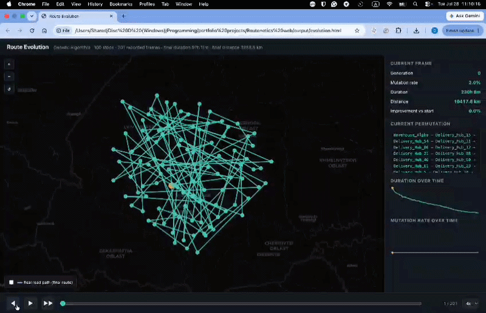
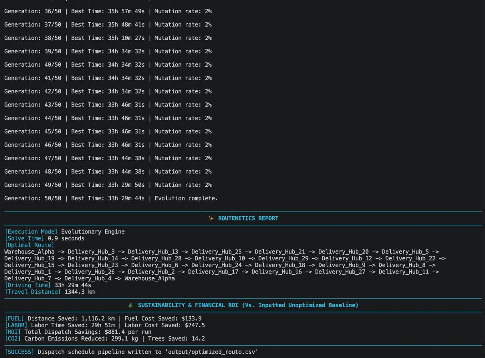

# 🧭 Routenetics

A delivery route optimizer (Traveling Salesman Problem solution) that solves a problem too large to brute-force at real-world scale: given a warehouse and a list of delivery stops, Routenetics finds a low-cost visiting order using genetic algorithm and actual driving durations distances pulled from OSRM (Open Source Routing Machine).

## Demo

Visualization of evolution 

> Note: the visualization tooling (the HTML/JS map, charts, and playback UI) was prototyped with AI assistance and is not included in this repository — only the resulting GIF is shown here for demonstration. The genetic algorithm, data pipeline, and CLI below are what this repo actually contains and what I built and iterated on.

CLI demo



## The problem
 
Route optimization is the classic Traveling Salesman Problem, and TSP doesn't get easier with a bigger computer: it gets exponentially harder with every stop you add. The number of possible visiting orders grows as a factorial, not linearly: a 15-stop route has about 87 billion possible orders. Push that to 23 stops (an ordinary day for a delivery driver) and even checking a billion routes per second, exhaustively verifying every single one takes on the order of **35,000 years**. Real delivery operations can't wait for that, so most either skip optimization entirely or settle for whatever a dispatcher's gut says is efficient, leaving real fuel, time, and money on the table every single day.


## Why a heuristic, not brute force
 
| Stops | Possible routes | Time to check all of them (at 1B routes/sec) |
|---|---|---|
| 15 | ~87 billion | ~1.5 minutes |
| 20 | ~122 quadrillion | ~3.9 years |
| 22 | ~51 quintillion | ~1,600 years |
| 23 | ~1.1 sextillion | ~35,000 years |
| 25 | ~620 sextillion | ~20 million years |
 
That's exactly why Routenetics doesn't try to brute-force its way through real route sizes. Below 8 stops, brute force is still fast enough to guarantee the mathematically perfect answer, so that's what it uses. Above that, it switches to a genetic algorithm - evolving a population of candidate routes generation over generation (via tournament selection, order crossover, elitism, and adaptive mutation) - in seconds instead of geological time. It's the practical trade: give up the guarantee of mathematical perfection to get an answer you can actually use before the delivery truck leaves.


## How it works

### Small instances → brute force
For 8 or fewer destinations, Routenetics checks every possible permutation and returns the guaranteed optimal route. This also serves as ground truth: the genetic algorithm's output was checked against brute force on 10–12 destination instances to confirm it reliably finds the true optimum before trusting it on larger, unverifiable problem sizes.

### Larger instances → genetic algorithm
For anything larger, an exhaustive search is computationally infeasible (a 30-stop problem has more possible routes than atoms in the observable universe), so the Genetic Algorithm searches instead:

- **Representation:** each individual is a permutation of destination indices, starting and ending at the depot.
- **Fitness:** total travel duration along the route, computed from a real OSRM duration matrix.
- **Selection:** tournament selection (sample 3 individuals at random, the fittest wins) — chosen over simpler roulette-wheel selection because it preserves more population diversity while still applying real selection pressure.
- **Elitism:** the top 2% of each generation survive unchanged, guaranteeing the best-found solution is never lost to bad luck in crossover or mutation.
- **Crossover:** an order-preserving crossover — a contiguous segment is copied from one parent, and the remaining stops are filled in the order they appear in the second parent, guaranteeing every child is a valid permutation (no duplicated or missing stops).
- **Mutation:** inversion mutation (reverse a random segment of the route) — chosen specifically because, unlike naive point-mutation, it can never produce an invalid permutation.
- **Adaptive mutation rate:** the mutation rate starts low (2%) and ramps up automatically the longer the best solution goes without improving, then resets the moment progress resumes. This was validated by tracking generations-since-improvement directly, rather than assumed to work.
- **ROI report:** converts the time and distance saved into fuel cost saved, labor cost saved, total dollar savings, and CO2 emissions avoided, and writes the optimized stop order out to a CSV for dispatch.


### A feature I built, tested, and removed
Early on, I hypothesized that populations could prematurely converge (all individuals becoming near-identical), and built a second mechanism to detect this directly — measuring genetic diversity via pairwise route-edge overlap — and inject fresh random "immigrant" individuals when diversity collapsed, deliberately forcing them to breed with fit individuals so they wouldn't just be discarded.

I then ran a controlled comparison: the same algorithm, same problem, same random seeds, with and without this mechanism, across multiple population sizes and generation counts (10+ seeds per condition). **The data showed the immigrant system didn't outperform the plain baseline** — in some configurations it was measurably worse, and in no configuration was it clearly better. Rather than keep a feature because it "sounded like it should work," I removed it and kept only the mutation-rate adaptation, which *did* show a measurable, reproducible benefit under the same kind of testing.

This is deliberately left as one of the lessons of the project: not every plausible-sounding idea holds up, and the only way to know is to measure it.

## Tech stack
 
- Python 3
- [OSRM](http://project-osrm.org/) — real-world driving distance/duration matrix via the public routing API
- [rich](https://github.com/Textualize/rich) — terminal UI (formatted reports, progress output)
- Genetic algorithm engine (tournament selection, order crossover, elitism, adaptive mutation) built from scratch for the routing problem

## Installation
 
```bash
pip install -r requirements.txt
```

## Usage

```bash
python3 main.py --file points.csv --pop_size 500 --generations 300
```

| Flag | Default | Description |
|---|---|---|
| `--file` | `points.csv` | CSV of destinations (`point_name,latitude,longitude`), read from `data/` |
| `--pop_size` | `500` | Population size for the genetic algorithm |
| `--generations` | `300` | Number of generations to run |

Input format:
```csv
point_name,latitude,longitude
Warehouse_Alpha,49.0275,24.3562
Delivery_Hub_1,48.9226,24.7111
...
```

---

## Project structure

```
routenetics/
├── main.py          # entry point, wires the pipeline together
├── ingestion.py      # CSV loading
├── network.py        # OSRM API calls (duration/distance matrix, route geometry)
├── engine.py          # brute force + genetic algorithm
├── cli.py             # argument parsing
└── data/
    └── points.csv
```

---

## Known limitations

- No way to verify how close the genetic algorithm's result is to true optimal beyond 8 stops, since brute force can't check it at that size — comparing against a known TSP benchmark dataset would help quantify the typical quality gap.
- ROI assumptions (fuel price, fuel consumption, labor rate, CO2 factor) are hardcoded defaults rather than CLI-configurable per run.
- No automated tests yet — correctness is currently verified manually against sample data.
- Single-vehicle routing only; doesn't yet account for multiple drivers, vehicle capacity, or delivery time windows.